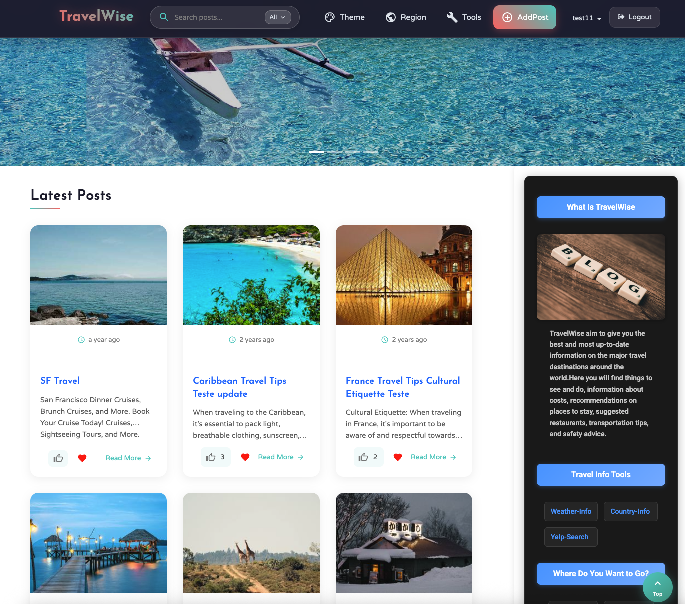

# TravelWise

- [TravelWise](#travelwise)
  - [Features](#features)
  - [Tech Stack](#tech-stack)
  - [Screenshots](#screenshots)
  - [Development Docs](#development-docs)
  - [Getting Started](#getting-started)
    - [Prerequisites](#prerequisites)
  - [Installation and Configuration](#installation-and-configuration)
  - [Running the Application](#running-the-application)
  - [Additional Information](#additional-information)

TravelWise is a comprehensive travel planning and social platform that allows users to discover destinations, share experiences, connect with fellow travelers, and access real-time travel information including weather, local businesses, and country details.

## Features

- **User Authentication**: Secure login and registration system.
- **Social Features**: Follow users, like and comment on posts, manage favorites.
- **Travel Content**: Create and share travel posts with images.
- **Search and Discovery**: Search for users, posts, and destinations.
- **AI-Powered Chatbot**: Get travel recommendations and assistance.
- **Vision Analysis**: Analyze uploaded images for travel insights.
- **Weather Integration**: Real-time weather updates for destinations.
- **Country Information**: Detailed country data and facts.
- **Yelp Integration**: Find local businesses and attractions.
- **Notifications**: Subscribe to updates and get notified.
- **Responsive Design**: Optimized for desktop and mobile devices.

## Tech Stack

- **Backend**: Node.js, Express.js, MySQL
- **Frontend**: React.js
- **External APIs**: OpenAI, SendGrid, Country API, Weather API, Yelp API

## Screenshots



## Development Docs

**NOTE: Click the below links to read the development docs**

1. [Project Plan](docs/travelwise_plan.pdf)
   1. Executive Summary
   1. Personas and User Stories
   1. Data Definitions and Structure Summary
   1. Initial list of functional requirements
   1. List of non-functional requirements
   1. Competitive analysis
   1. Advantages Summary
   1. High-level system requirements
1. [MUST READ: Overall Design](docs/travelwise_design.pdf)
   1. Data Definitions
   1. Functional requirements
   1. UI Mockups and UX Flow
   1. High-level Architecture, Database Organization
   1. High-Level UML Diagrams
1. [Test Report](docs/tw_testing_report.pdf)
   1. Test Cases
   1. Test Coverage

## Getting Started

### Prerequisites

Make sure you have the following installed:

- Node.js
- npm (Node Package Manager)
- MySQL Server and Client Utility like MySQL CLI/MySQLWorkbench

## Installation and Configuration

1. Clone the repository

   ```sh
   git clone https://github.com/yuqiao1205/travelwise_v2.0
   cd travelwise_v2.0
   ```

1. Importing the Database

   1. Ensure MySQL Server is running on your local machine and client utilities are installed.
   1. Import the database schema and initial content by using the database script file `scripts/db/dump20241013.sql`.
      1. You can use utility like MySQL CLI or MySQLWorkbench to run the database import script. It will create the travelwise schema if not present.

1. Install dependencies for backend and frontend.

   ```sh
   # Go to application/api folder
   cd application/api
   npm install

   # Go to application/client folder
   cd ../client
   npm install
   ```

1. Create and configure the backend .env file at `application/api/.env`, please use the below configuration template, configuration items are required for the respective features.

   ```.env
   # Local
   DATABASE_HOST=<db_hostname>
   DATABASE_USER=<db_user>
   DATABASE_PASS=<db_password>
   DATABASE_SCHEMA=travelwise

   # All API keys
   SENDGRID_API_KEY=  # To get SendGrid API Key for Mailing. Visit (https://login.sendgrid.com).
   OPENAI_API_KEY=    # OpenAI API Key for ChatBot and Vision Feature.
   COUNTRY_API_KEY=   # To get Country API Key for country info feature. Visit (https://countryapi.io/)
   WEATHER_API_KEY=   # To get Weather API Key, Visit (https://openweathermap.org/api).
   X_RAPID_API_KEY=   # To get XRapidAPI Key for Weather Feature, Visit (https://rapidapi.com/hub)
   YELP_API_KEY=      # Yelp API Key for Yelp search Feature. Find yelp business api.

   # Secret key for the authentication password encryption, this is used in the initial database content.
   Secret_Key=c1b586dc616452c1ced1f6bb65af186c
   ```

## Running the Application

1. Start the backend

   ```sh
   cd application/api
   npm start
   ```

   - The backend will run on `http://localhost:8800`.

1. Start the frontend

   Open another terminal and run the command

   ```sh
   cd application/client
   npm start
   ```

   - The frontend will run on `http://localhost:3000` and you can access the TravelWise application at that URL.

1. NOTE: You can use the [Caddy](https://caddyserver.com/) to expose the application to HTTPS.

## Additional Information

When you first run the application, to access all features such as commenting, liking, and following, please register before logging in. Alternatively, if you prefer to log in directly, input the username: yanpeng and password: sfuser.

Thank you for checking out this project!
I hope you find it useful and enjoyable to explore.
